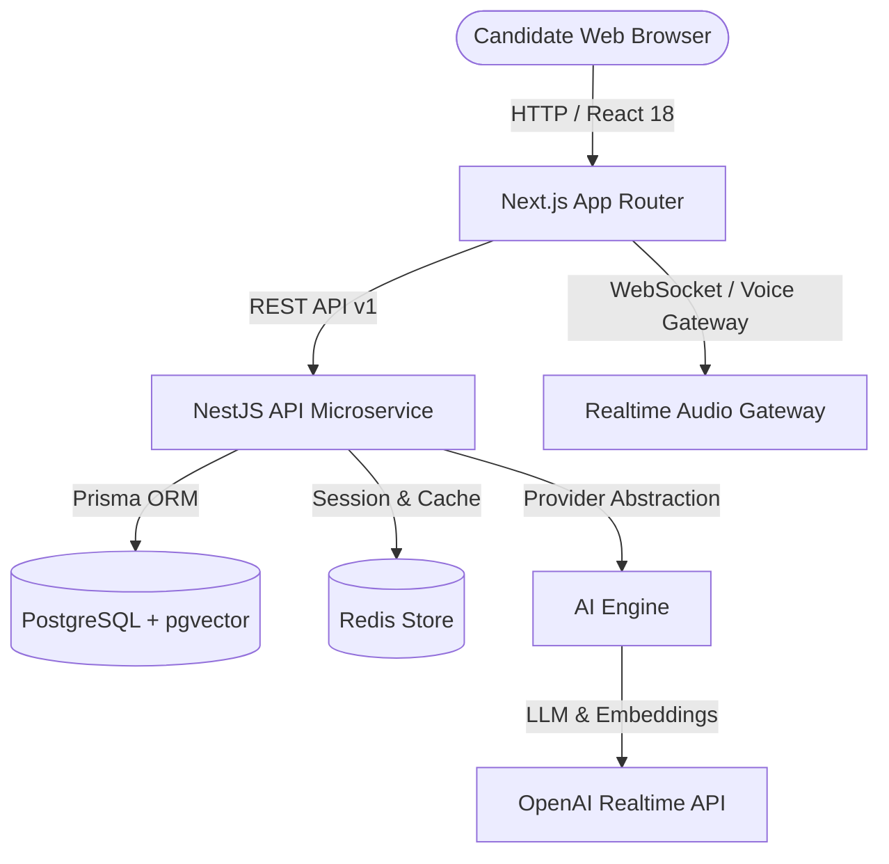

# AI Interview Coach

> Real-time AI-powered voice interview coach with personalized interviews, memory, RAG, animated avatar, and intelligent performance feedback.

[](https://github.com/ai-interview-coach/ai-interview-coach/actions)
[](https://www.typescriptlang.org/)
[](https://nextjs.org/)
[](https://nestjs.com/)
[](https://www.docker.com/)
[](LICENSE)

---

## Features

- [x] **Full-Stack Monorepo Architecture**: Clean separation between Next.js frontend, NestJS backend microservices, and shared workspace packages *(Phase 1)*.
- [x] **Health Check & API Versioning**: Standardized URI versioning (`/api/v1`) with global exception handling *(Phase 1)*.
- [x] **Authentication & User Profiles**: Secure JWT authentication, Argon2id hashing, refresh token rotation, and career profile preferences *(Phase 2)*.
- [x] **Interview Management**: Configurable interviews across Technical, HR, Behavioral, Coding, System Design roles with state machine *(Phase 3)*.
- [x] **AI Interviewer Engine**: Domain system prompt engineering & AI provider abstractions (`MockAIProvider`, `OpenAIProvider`) *(Phase 4)*.
- [x] **Real-Time Voice Streaming**: Low-latency WebSocket gateway (`/voice`) handling audio stream simulation & visualizer feedback *(Phase 5)*.
- [x] **Animated AI Avatar**: Tactile Neumorphic 3D / SVG speech visualizer avatar with dynamic listening, thinking, and speaking states *(Phase 6)*.
- [x] **RAG & Candidate Memory**: Resume & Job Description vector store (`pgvector`) for contextual AI prompt injection *(Phase 7)*.
- [x] **Intelligent Evaluation & Feedback**: Multi-metric evaluation engine (Overall, Technical, Communication, Confidence scores) and detailed reports *(Phase 8)*.
- [x] **Analytics & Performance Dashboard**: Interactive skill radar breakdown, score progression timeline, and targeted weak-area practice drills *(Phase 9)*.
- [x] **Production Hardening**: Rate limiting, security headers, CORS origin validation, and production Docker Compose setup *(Phase 10)*.

---

## Architecture



---

## Tech Stack

### Frontend
- **Framework**: Next.js 14 (App Router)
- **UI Components**: React 18, Tailwind CSS, Lucide Icons, Framer Motion
- **Design System**: Neumorphic / Soft UI `#E0E5EC` Tactile Palette
- **State Management**: Zustand & React Context

### Backend
- **Framework**: NestJS (Node.js & TypeScript)
- **Real-Time**: `@nestjs/websockets` & Socket.IO
- **Security**: Argon2id Hashing, Passport JWT Token Rotation
- **API Standard**: REST with URI versioning (`/api/v1`), WebSockets

### Database & Cache
- **Database**: PostgreSQL 16 with `pgvector`
- **ORM**: Prisma ORM (User, UserProfile, RefreshToken, Interview, Question, Message, CandidateDocument, EvaluationReport)
- **Caching & State**: Redis 7

---

## Complete Development Roadmap

| Phase | Milestone | Status | Description |
| :--- | :--- | :--- | :--- |
| **Phase 1** | **Foundation & Architecture** | 🟢 **Completed** | Full-stack monorepo, NestJS API health check, Next.js dashboard shell, shared packages, Docker Compose. |
| **Phase 2** | **Authentication & User Profile** | 🟢 **Completed** | JWT auth, Argon2id, refresh token rotation, Prisma PostgreSQL models, Neumorphic Register, Login & Profile UIs. |
| **Phase 3** | **Interview Management** | 🟢 **Completed** | Creation, configuration (Role, Difficulty, Duration, Type), state machine, Prisma models, Neumorphic Wizard & Lobby UIs. |
| **Phase 4** | **AI Text Interviewer** | 🟢 **Completed** | AI provider engine, domain prompts, chat REST microservice, Neumorphic Live Session Room. |
| **Phase 5** | **Real-Time Voice Interview** | 🟢 **Completed** | NestJS WebSocket voice gateway (`/voice`), audio chunk streaming & visualizer spectrum events. |
| **Phase 6** | **Animated AI Avatar** | 🟢 **Completed** | Neumorphic Animated AI Avatar with listening, thinking, speaking states and audio spectrum ring. |
| **Phase 7** | **RAG & Candidate Memory** | 🟢 **Completed** | Resume & JD document parser, chunking pipeline, pgvector integration, Neumorphic RAG Document Manager UI. |
| **Phase 8** | **Intelligent Evaluation** | 🟢 **Completed** | Multi-metric evaluation reports (Overall, Technical, Communication, Confidence) & Neumorphic Report UI. |
| **Phase 9** | **Dashboard & Analytics** | 🟢 **Completed** | Neumorphic Analytics Dashboard with skill radar breakdown, score progression timeline, and target drills. |
| **Phase 10** | **Production Hardening** | 🟢 **Completed** | Rate limiting, CORS, security audit, production Docker orchestration across all 5 container services. |

---

## Getting Started

### Prerequisites
- Node.js >= 20.0.0
- pnpm >= 9.0.0
- Docker & Docker Compose

### Local Installation

1. **Clone the repository:**
   ```bash
   git clone https://github.com/ai-interview-coach/ai-interview-coach.git
   cd ai-interview-coach
   ```

2. **Copy environment variables:**
   ```bash
   cp .env.example .env
   ```

3. **Install dependencies across the monorepo:**
   ```bash
   pnpm install
   ```

4. **Build shared workspace packages:**
   ```bash
   pnpm --filter @ai-interview-coach/types build
   pnpm --filter @ai-interview-coach/shared build
   pnpm --filter @ai-interview-coach/ai build
   ```

5. **Start development stack:**
   ```bash
   pnpm dev
   ```

- **Frontend App**: [http://localhost:3000](http://localhost:3000)
- **Backend API**: [http://localhost:3001/api/v1/health](http://localhost:3001/api/v1/health)

---

## Docker Setup

To launch all 10 phases using Docker Compose:

```bash
docker-compose up --build -d
```

Check health status:
```bash
curl http://localhost:3001/api/v1/health
```

---

## Testing

```bash
# Run all workspace tests
pnpm test

# Run NestJS API unit tests
pnpm test:api

# Run NestJS API E2E tests
pnpm test:api:e2e
```

---

## License

This project is licensed under the MIT License - see the [LICENSE](LICENSE) file for details.
