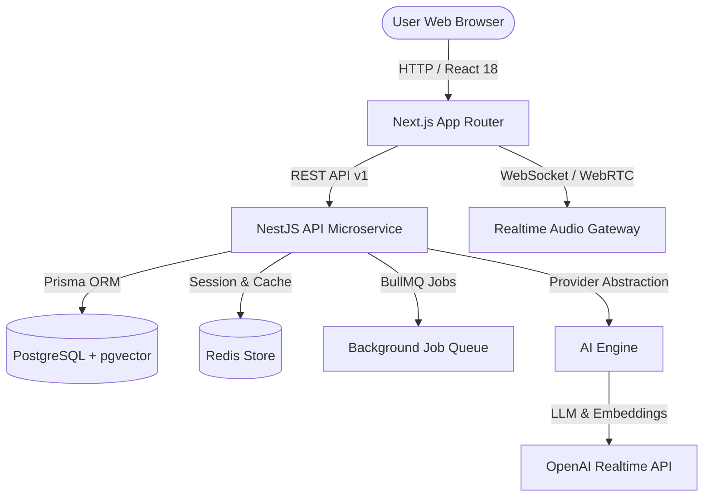

# AI Interview Coach

> Real-time AI-powered voice interview coach with personalized interviews, memory, RAG, animated avatar, and intelligent performance feedback.

[](https://github.com/ai-interview-coach/ai-interview-coach/actions)
[](https://www.typescriptlang.org/)
[](https://nextjs.org/)
[](https://nestjs.com/)
[](https://www.docker.com/)
[](LICENSE)

---

## Features

- [x] **Full-Stack Monorepo Architecture**: Clean separation between Next.js frontend, NestJS backend microservices, and shared workspace packages *(Phase 1)*.
- [x] **Health Check & API Versioning**: Standardized URI versioning (`/api/v1`) with global exception handling *(Phase 1)*.
- [x] **Authentication & User Profiles**: Secure JWT authentication, Argon2id hashing, refresh token rotation, and profile management *(Phase 2)*.
- [x] **Interview Management**: Configurable interviews across Technical, HR, Behavioral, Coding, System Design roles with state machine *(Phase 3)*.
- [ ] **AI Interviewer**: Provider abstraction engine supporting OpenAI & Pipecat with prompt engineering *(Phase 4)*.
- [ ] **Real-Time Voice Streaming**: Low-latency WebSocket / WebRTC audio streaming with interruption detection *(Phase 5)*.
- [ ] **Animated Avatar**: 3D avatar with real-time speech visualizer powered by React Three Fiber & Framer Motion *(Phase 6)*.
- [ ] **RAG & Candidate Memory**: Resume & Job Description parsing with vector search via PostgreSQL `pgvector` & Redis *(Phase 7)*.
- [ ] **Intelligent Evaluation & Feedback**: Granular scoring on technical correctness, communication, and confidence *(Phase 8)*.
- [ ] **Analytics & History**: Interactive charts tracking performance over time and targeted weak area practice *(Phase 9)*.
- [ ] **Production Hardening**: Rate limiting, security headers, helmet, and production Docker compose setup *(Phase 10)*.

---

## Architecture



---

## Tech Stack

### Frontend
- **Framework**: Next.js 14 (App Router)
- **UI Components**: React 18, Tailwind CSS, Lucide Icons, Framer Motion
- **Design System**: Neumorphic / Soft UI `#E0E5EC` Tactile Palette
- **State Management**: Zustand & React Context
- **Graphics**: React Three Fiber / Three.js *(Phase 6)*

### Backend
- **Framework**: NestJS (Node.js & TypeScript)
- **Security**: Argon2id Hashing, Passport JWT Token Rotation
- **API Standard**: REST with URI versioning (`/api/v1`), WebSockets
- **Validation & Errors**: Class-Validator & Global Exception Filters

### Database & Cache
- **Database**: PostgreSQL 16 with `pgvector`
- **ORM**: Prisma ORM (User, UserProfile, RefreshToken, Interview, Question)
- **Caching & State**: Redis 7
- **Queue**: BullMQ

### AI & Realtime
- **Providers**: OpenAI Realtime API, Provider Abstraction Layer (Pipecat compatible)

---

## Development Roadmap

| Phase | Milestone | Status | Description |
| :--- | :--- | :--- | :--- |
| **Phase 1** | **Foundation & Architecture** | 🟢 **Completed** | Full-stack monorepo, NestJS API health check, Next.js dashboard shell, shared packages, Docker Compose. |
| **Phase 2** | **Authentication & User Profile** | 🟢 **Completed** | JWT auth, Argon2id, refresh token rotation, Prisma PostgreSQL models, Neumorphic Register, Login & Profile UIs. |
| **Phase 3** | **Interview Management** | 🟢 **Completed** | Creation, configuration (Role, Difficulty, Duration, Type), state machine, Prisma models, Neumorphic Wizard & Lobby UIs. |
| **Phase 4** | AI Text Interviewer | 🟡 Planned | Conversational AI agent, provider abstractions, stateful Q&A. |
| **Phase 5** | Real-Time Voice Interview | 🟡 Planned | Audio streaming, WebSockets, real-time transcription & interruption handling. |
| **Phase 6** | Animated AI Avatar | 🟡 Planned | React Three Fiber 3D avatar, lip sync, state visualizers. |
| **Phase 7** | RAG & User Memory | 🟡 Planned | Resume/JD PDF upload, vector search (pgvector), long-term candidate memory. |
| **Phase 8** | Intelligent Evaluation | 🟡 Planned | Multi-metric evaluation reports, scoring engine, targeted study plan. |
| **Phase 9** | Dashboard & Analytics | 🟡 Planned | Recharts performance charts, interview history, weak area drills. |
| **Phase 10** | Production Hardening | 🟡 Planned | Rate limiting, CORS, security audit, production Docker orchestration. |

---

## Getting Started

### Prerequisites
- Node.js >= 20.0.0
- pnpm >= 9.0.0 (or npm / yarn)
- Docker & Docker Compose (optional for local DB/Redis)

### Local Installation

1. **Clone the repository:**
   ```bash
   git clone https://github.com/ai-interview-coach/ai-interview-coach.git
   cd ai-interview-coach
   ```

2. **Copy environment variables:**
   ```bash
   cp .env.example .env
   ```

3. **Install dependencies across the monorepo:**
   ```bash
   pnpm install
   ```

4. **Build shared workspace packages:**
   ```bash
   pnpm --filter @ai-interview-coach/types build
   pnpm --filter @ai-interview-coach/shared build
   pnpm --filter @ai-interview-coach/ai build
   ```

5. **Start development servers:**
   ```bash
   pnpm dev
   ```

- **Frontend App**: [http://localhost:3000](http://localhost:3000)
- **Backend API**: [http://localhost:3001/api/v1/health](http://localhost:3001/api/v1/health)

---

## Docker Setup

To launch the full stack with PostgreSQL (pgvector), Redis, NestJS API, and Next.js Web:

```bash
docker-compose up --build -d
```

Check health status:
```bash
curl http://localhost:3001/api/v1/health
```

---

## Testing

Run unit and integration tests across all workspaces:

```bash
# Run all workspace tests
pnpm test

# Run NestJS API unit tests
pnpm test:api

# Run NestJS API E2E tests
pnpm test:api:e2e
```

---

## API Documentation

### Auth Endpoints (Phase 2)
- `POST /api/v1/auth/register`: Register candidate account & return tokens.
- `POST /api/v1/auth/login`: Authenticate candidate & return tokens.
- `POST /api/v1/auth/refresh`: Rotate refresh token & return new token pair.
- `POST /api/v1/auth/logout`: Revoke active session refresh tokens.
- `GET /api/v1/users/me`: Fetch authenticated candidate profile.
- `PATCH /api/v1/users/me`: Update candidate career preferences & tech stack.

### Interview Management Endpoints (Phase 3)
- `POST /api/v1/interviews`: Create new interview practice session & seed questions.
- `GET /api/v1/interviews`: List candidate interview sessions with filters & search.
- `GET /api/v1/interviews/:id`: Fetch single interview session details & seeded questions.
- `PATCH /api/v1/interviews/:id/status`: Update interview session state machine.
- `DELETE /api/v1/interviews/:id`: Delete or cancel interview practice session.

---

## License

This project is licensed under the MIT License - see the [LICENSE](LICENSE) file for details.
