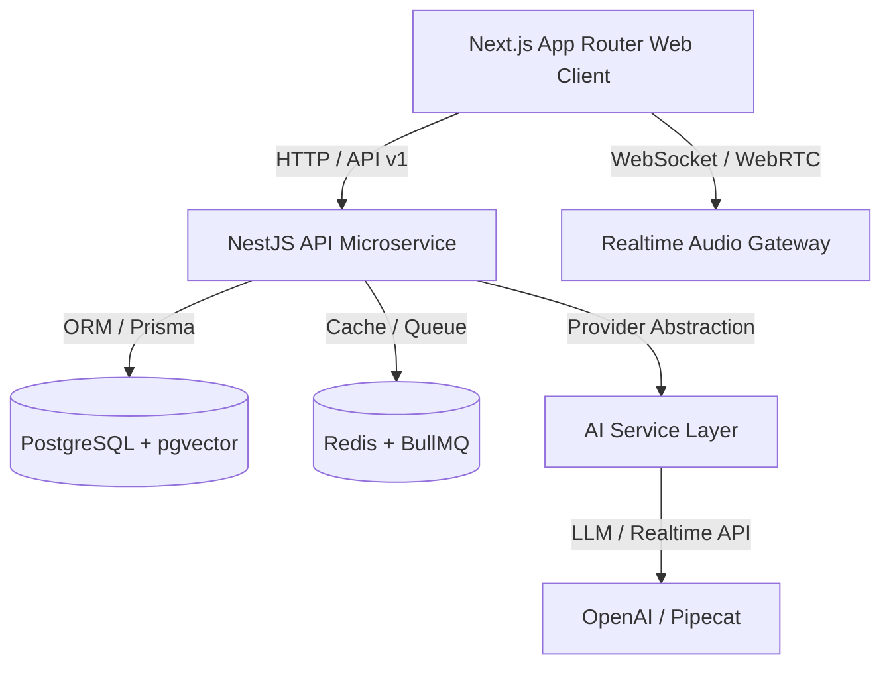

# System Architecture Document

## Overview

The **AI Interview Coach** is built as an enterprise monorepo using Node.js, Next.js, NestJS, TypeScript, Tailwind CSS, PostgreSQL (`pgvector`), Redis, and OpenAI Realtime API.

## Core Components

1. **Frontend (`apps/web`)**: Next.js App Router providing interactive voice room, Three.js avatar rendering, real-time transcript streaming, and analytics.
2. **Backend (`apps/api`)**: NestJS modular application handling authentication, interview orchestration, evaluation processing, and RAG document vector pipelines.
3. **Shared Abstractions (`packages/*`)**: TypeScript DTOs, Provider interfaces (`AIInterviewProvider`), and common utilities.
4. **Data Infrastructure**: PostgreSQL with `pgvector` for candidate vector memory & document chunking; Redis for high-speed session management and background task queuing via BullMQ.
