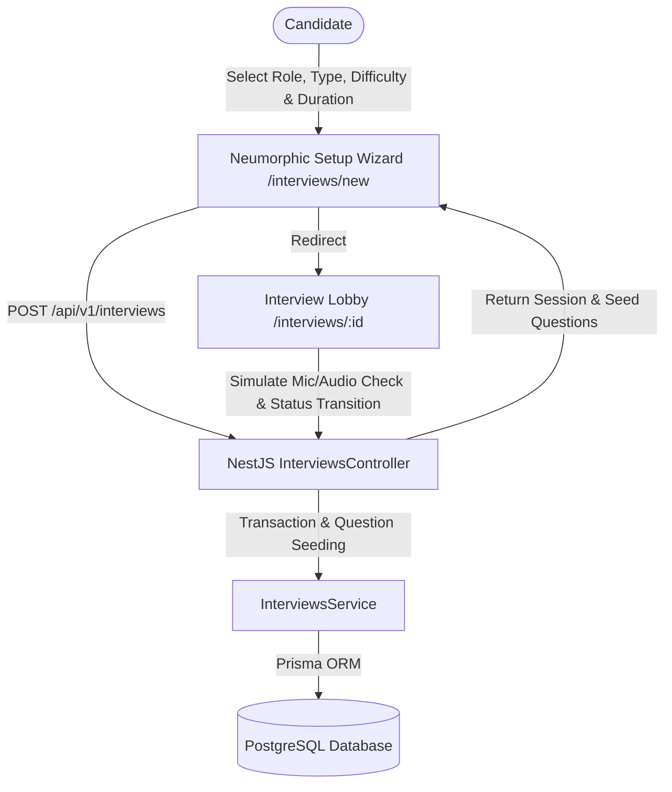

# Phase 3: Interview Management Documentation

## Overview
Phase 3 introduces the core **Interview Management Engine** for the **AI Interview Coach** platform. Candidates can configure, create, launch, and manage interview practice sessions across Technical, HR, Behavioral, Coding, and System Design domains with customizable target roles, difficulty levels, target companies, and time limits.

---

## Architecture & Data Flow



---

## Database Models (`schema.prisma`)

```prisma
enum InterviewType {
  TECHNICAL
  HR
  BEHAVIORAL
  CODING
  SYSTEM_DESIGN
  MIXED
}

enum InterviewDifficulty {
  EASY
  MEDIUM
  HARD
  EXPERT
}

enum InterviewStatus {
  IDLE
  READY
  IN_PROGRESS
  PAUSED
  COMPLETED
  CANCELLED
}

model Interview {
  id                 String              @id @default(uuid())
  userId             String
  user               User                @relation(fields: [userId], references: [id], onDelete: Cascade)
  title              String
  type               InterviewType       @default(TECHNICAL)
  difficulty         InterviewDifficulty @default(MEDIUM)
  status             InterviewStatus     @default(IDLE)
  targetRole         String
  targetCompany      String?
  durationMinutes    Int                 @default(30)
  customInstructions String?
  score              Float?
  summary            String?
  startedAt          DateTime?
  endedAt            DateTime?
  createdAt          DateTime            @default(now())
  updatedAt          DateTime            @updatedAt

  questions          Question[]

  @@index([userId])
  @@index([status])
  @@map("interviews")
}

model Question {
  id             String    @id @default(uuid())
  interviewId    String
  interview      Interview @relation(fields: [interviewId], references: [id], onDelete: Cascade)
  orderIndex     Int
  text           String
  category       String?
  expectedAnswer String?
  userAnswer     String?
  feedback       String?
  score          Float?
  createdAt      DateTime  @default(now())
  updatedAt      DateTime  @updatedAt

  @@index([interviewId])
  @@map("questions")
}
```

---

## REST API Specifications

### 1. Create Interview Session
- **Endpoint**: `POST /api/v1/interviews` *(Bearer Token Required)*
- **Request Body**:
  ```json
  {
    "targetRole": "Senior Full-Stack Engineer",
    "targetCompany": "Google",
    "type": "TECHNICAL",
    "difficulty": "HARD",
    "durationMinutes": 45,
    "customInstructions": "Focus heavily on distributed caching and concurrency."
  }
  ```
- **Response**: `201 Created` with Interview DTO & Seed Questions.

### 2. List Candidate Interviews
- **Endpoint**: `GET /api/v1/interviews?type=TECHNICAL&status=IDLE` *(Bearer Token Required)*
- **Response**: `200 OK` with filtered list of candidate sessions.

### 3. Get Interview Lobby Details
- **Endpoint**: `GET /api/v1/interviews/:id` *(Bearer Token Required)*
- **Response**: `200 OK` with full interview parameters and question outline.

### 4. Update Status Transition
- **Endpoint**: `PATCH /api/v1/interviews/:id/status` *(Bearer Token Required)*
- **Request Body**: `{"status": "IN_PROGRESS"}`
- **Response**: `200 OK` updating status and `startedAt` / `endedAt` timestamps.

### 5. Delete Interview Session
- **Endpoint**: `DELETE /api/v1/interviews/:id` *(Bearer Token Required)*
- **Response**: `200 OK` deleting interview session and questions.

---

## Neumorphic Frontend Pages

- `/interviews/new`: Soft UI Interview Creation Wizard with type cards, difficulty pills, duration selectors, and custom instructions input well.
- `/interviews`: Soft UI Candidate Dashboard & List view with status badges, search bar, and action triggers.
- `/interviews/[id]`: Pre-interview Lobby Stage featuring audio/hardware verification simulations, question outlines, and session launch triggers.
- `/dashboard`: Updated Dashboard Shell with live interview metrics and quick session triggers.

---

## Test & Build Verification
- **Unit Tests**: `4 passed, 4 total` (`InterviewsService`, `AuthService`, `UsersService`, `HealthController`)
- **E2E Tests**: Clean execution for Interview Creation, Retrieval, Status Updates, and Deletion.
- **Frontend Build**: Next.js compiled `10 static pages` with **0 errors**.
